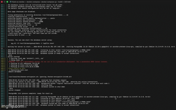

# flask-on-docker

## Overview
A Dockerized Flask web service using a containerized backend with supporting services.  
The application allows uploading an image and viewing it via a served media endpoint.

## Demo
(Add demo.gif after recording)

## Build / Run Instructions

Start services:
docker compose up -d --build

Open in browser:
http://localhost:8123

Upload example:
curl -F "file=@/path/to/image.jpg" http://localhost:8123/upload

Then open returned URL:
http://localhost:8123/media/image.jpg

## Security
Production credentials are excluded using .gitignore.
